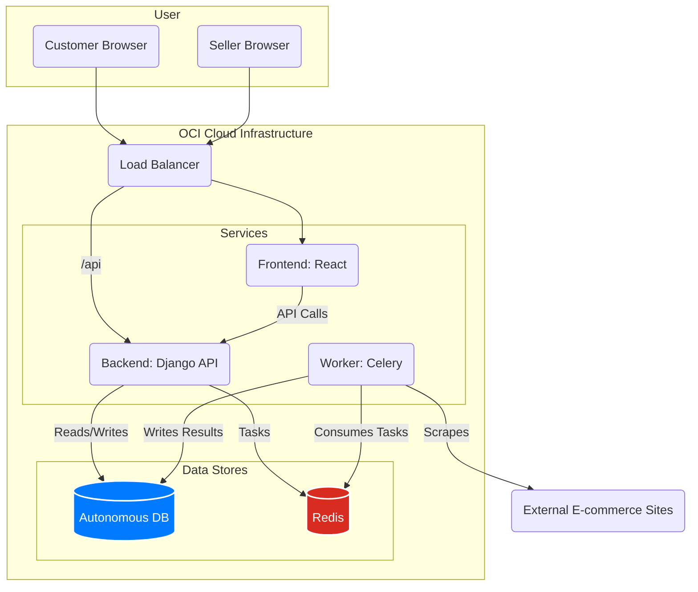

<div align="center">

# 🛒 Caça-Preço (PriceHunter) - Marketplace & Competitor Intelligence Suite
### A full-stack solution empowering sellers with data-driven insights.


</div>

---

## 🚀 Business Overview

**Caça-Preço** (PriceHunter) is a comprehensive marketplace platform designed with a unique SaaS module for sellers: **automated competitor price monitoring**. The platform connects customers with vendors while providing sellers with a powerful competitive intelligence tool to optimize their pricing strategies and maximize sales.

The core value proposition is to transform a standard e-commerce experience into a data-driven ecosystem where vendors can react to market changes in real-time.

---

## 🏛️ System Architecture

The application is built on a decoupled, service-oriented architecture, ensuring scalability and maintainability. The frontend is separated from the backend, and asynchronous tasks like web scraping are handled by dedicated workers.



---

## ✨ Key Features

-   **For Customers:**
    -   🔍 **Product Search & Comparison:** Create shopping lists and find the best prices across multiple stores.
    -   🛒 **Optimized Cart Suggestions:** The system can suggest the best combination of stores for the lowest total cost.
-   **For Sellers:**
    -   🏪 **Store & Product Management:** Full CRUD operations for products, stores, and promotional offers.
    -   📈 **Sales Dashboard:** Track performance, sales metrics, and customer reviews.
    -   🕵️ **Competitor Monitoring (SaaS):** An automated web scraping module to monitor competitor prices, providing a strategic advantage.

---

## ⚙️ Tech Stack

| Layer | Technology | Purpose |
| :--- | :--- | :--- |
| **Frontend** | React, React Router, `@cidqueiroz/cdkteck-ui` | A responsive and interactive Single Page Application (SPA). |
| **Backend** | Django, Django Rest Framework | The central RESTful API handling all business logic. |
| **Asynchronous Tasks** | Celery, Redis | Manages long-running, scheduled tasks like web scraping without blocking the API. |
| **Web Scraping** | Scrapy, Selenium, Playwright | A multi-tool approach to reliably extract data from various e-commerce sites. |
| **Database** | Oracle Autonomous Database (on OCI) | Scalable and secure storage for all platform data. |
| **DevOps** | Docker, Docker Compose, GitHub Actions | Containerized local development and automated CI/CD to OCI. |

---

## 🛠️ Getting Started: Local Development

The entire application stack is containerized with Docker for a simple and consistent local development setup.

### Prerequisites
* Docker & Docker Compose
* Git

### 1. Clone the Repository
```bash
git clone https://github.com/CidQueiroz/Caca-Preco.git
cd Caca-Preco
```

### 2. Configure Environment Variables

Create an `.env` file in the root directory for the backend and frontend. You can copy the `.env.example` file if it exists.

**Key variables to set:**
-   `DATABASE_URL`: Your local or cloud database connection string.
-   `SECRET_KEY`: A Django secret key.
-   `NODE_AUTH_TOKEN`: Your GitHub PAT to install `@cidqueiroz/cdkteck-ui`.

### 3. Build and Run the Application

This single command will build all the images (backend, frontend, celery worker) and start the services.

```bash
# Ensure NODE_AUTH_TOKEN is exported in your shell
export NODE_AUTH_TOKEN="YOUR_GITHUB_PAT_HERE"

# Build and start the containers
docker-compose up --build
```
-   **Backend API** will be available at `http://localhost:8000`.
-   **Frontend App** will be available at `http://localhost:3001`.

---

## 🚀 CI/CD Pipeline

The project is configured with GitHub Actions for a complete CI/CD workflow:

1.  **On Push to `main`:**
    - A `release` workflow is triggered.
    - `semantic-release` analyzes commits and creates a new version tag if applicable.
2.  **On New Release:**
    - A `deploy` workflow is triggered.
    - It connects to the OCI VM via SSH.
    - It pulls the latest code, and runs `docker-compose -f docker-compose.prod.yml up --build -d` to rebuild and restart the production services.
    - The `NODE_AUTH_TOKEN` is passed securely as a build argument to Docker, allowing the private `cdkteck-ui` package to be installed during the production build.