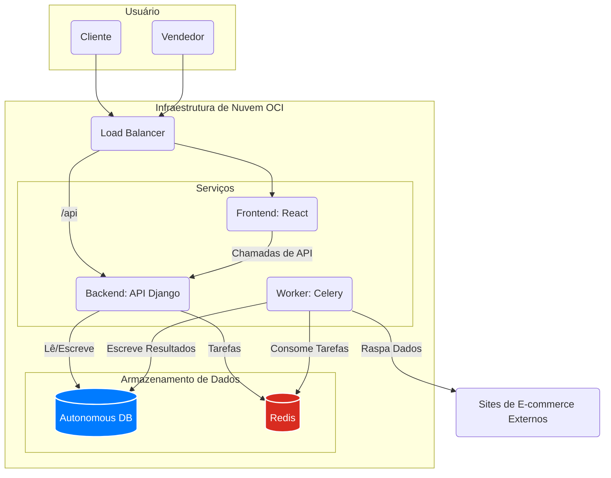

<div align="center">

# 🛒 Caça-Preço - Marketplace & Suíte de Inteligência Competitiva
### Uma solução full-stack que capacita vendedores com insights baseados em dados.


</div>

---

## 🚀 Visão de Negócio

O **Caça-Preço** é uma plataforma de marketplace abrangente, projetada com um módulo SaaS exclusivo para vendedores: **monitoramento automatizado de preços da concorrência**. A plataforma conecta clientes a lojistas, ao mesmo tempo que fornece aos vendedores uma poderosa ferramenta de inteligência competitiva para otimizar suas estratégias de precificação e maximizar as vendas.

A proposta de valor central é transformar uma experiência padrão de e-commerce em um ecossistema orientado a dados, onde os vendedores podem reagir às mudanças do mercado em tempo real.

---

## 🏛️ Arquitetura do Sistema

A aplicação é construída sobre uma arquitetura de serviços desacoplada, garantindo escalabilidade e manutenibilidade. O frontend é separado do backend, e tarefas assíncronas como web scraping são gerenciadas por workers dedicados.



---

## ✨ Funcionalidades Chave

-   **Para Clientes:**
    -   🔍 **Busca e Comparação de Preços:** Crie listas de compras e encontre os melhores preços em múltiplas lojas.
    -   🛒 **Sugestões de Carrinho Otimizadas:** O sistema pode sugerir a melhor combinação de lojas para o menor custo total.
-   **Para Vendedores:**
    -   🏪 **Gestão de Loja e Produtos:** Operações CRUD completas para produtos, lojas e ofertas promocionais.
    -   📈 **Dashboard de Vendas:** Acompanhe o desempenho, métricas de vendas e avaliações de clientes.
    -   🕵️ **Monitoramento de Concorrência (SaaS):** Um módulo de web scraping automatizado para monitorar os preços da concorrência, fornecendo uma vantagem estratégica.

---

## ⚙️ Stack de Tecnologias

| Camada | Tecnologia | Propósito |
| :--- | :--- | :--- |
| **Frontend** | React, React Router, `@cidqueiroz/cdkteck-ui` | Uma Single Page Application (SPA) responsiva e interativa. |
| **Backend** | Django, Django Rest Framework | A API RESTful central que gerencia toda a lógica de negócio. |
| **Tarefas Assíncronas** | Celery, Redis | Gerencia tarefas de longa duração e agendadas, como web scraping, sem bloquear a API. |
| **Web Scraping** | Scrapy, Selenium, Playwright | Uma abordagem multi-ferramenta para extrair dados de vários sites de e-commerce de forma confiável. |
| **Banco de Dados** | Oracle Autonomous Database (na OCI) | Armazenamento escalável e seguro para todos os dados da plataforma. |
| **DevOps** | Docker, Docker Compose, GitHub Actions | Ambiente de desenvolvimento local containerizado e CI/CD automatizado para a OCI. |

---

## 🛠️ Começando: Desenvolvimento Local

Toda a stack da aplicação é containerizada com Docker para uma configuração de desenvolvimento local simples e consistente.

### Pré-requisitos
* Docker & Docker Compose
* Git

### 1. Clone o Repositório
```bash
git clone https://github.com/CidQueiroz/Caca-Preco.git
cd Caca-Preco
```

### 2. Configure as Variáveis de Ambiente

Crie um arquivo `.env` na raiz do projeto para o backend e o frontend. Você pode copiar o arquivo `.env.example` se ele existir.

**Principais variáveis a serem configuradas:**
-   `DATABASE_URL`: Sua string de conexão do banco de dados local ou na nuvem.
-   `SECRET_KEY`: Uma chave secreta para o Django.
-   `NODE_AUTH_TOKEN`: Seu PAT do GitHub para instalar o `@cidqueiroz/cdkteck-ui`.

### 3. Construa e Execute a Aplicação

Este único comando construirá todas as imagens (backend, frontend, celery worker) e iniciará os serviços.

```bash
# Garanta que o NODE_AUTH_TOKEN está exportado no seu shell
export NODE_AUTH_TOKEN="SEU_PAT_DO_GITHUB_AQUI"

# Construa e inicie os containers
docker-compose up --build
```
-   **API do Backend** estará disponível em `http://localhost:8000`.
-   **Aplicação Frontend** estará disponível em `http://localhost:3001`.

---

## 🚀 Pipeline de CI/CD

O projeto está configurado com GitHub Actions para um fluxo de trabalho de CI/CD completo:

1.  **No Push para a `main`:**
    - Um workflow de `release` é acionado.
    - O `semantic-release` analisa os commits e cria uma nova tag de versão, se aplicável.
2.  **Em um Novo Release:**
    - Um workflow de `deploy` é acionado.
    - Ele se conecta à VM da OCI via SSH.
    - Baixa o código mais recente e executa `docker-compose -f docker-compose.prod.yml up --build -d` para reconstruir e reiniciar os serviços de produção.
    - O `NODE_AUTH_TOKEN` é passado de forma segura como um argumento de build para o Docker, permitindo que o pacote privado `cdkteck-ui` seja instalado durante o build de produção.
