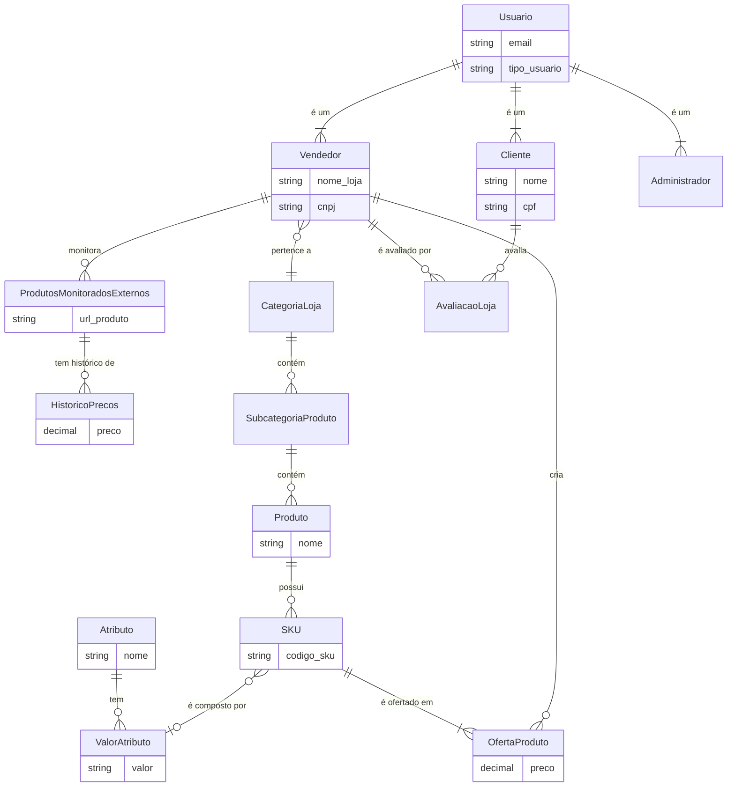

# Esquema do Banco de Dados (Atualizado)

Este documento descreve as principais tabelas (modelos Django) do banco de dados da aplicação, refletindo a estrutura de código mais recente.

## Modelos de Usuário e Perfis

### `Usuario`
Modelo customizado que serve como base para todos os usuários do sistema.
- `email`: Usado como campo de login único.
- `tipo_usuario`: Campo de escolha que define o papel do usuário (`Cliente`, `Vendedor`, `Administrador`).
- `is_active`: Controla se o usuário pode fazer login (ativado após verificação de e-mail).
- `is_staff`: Acesso ao Django Admin.
- `email_verificado`, `token_verificacao`, etc.: Campos para o fluxo de verificação de e-mail e recuperação de senha.

### `Cliente`
Perfil específico para usuários do tipo 'Cliente'.
- `usuario`: Relacionamento 1-para-1 com `Usuario`.
- `nome`, `cpf`, `data_nascimento`, `telefone`.
- `endereco`: Chave estrangeira para `Endereco`.

### `Vendedor`
Perfil específico para usuários do tipo 'Vendedor'.
- `usuario`: Relacionamento 1-para-1 com `Usuario`.
- `nome_loja`, `cnpj`, `status_aprovacao`.
- `categoria_loja`: Chave estrangeira para `CategoriaLoja`.
- Outros campos de perfil como `horario_funcionamento`, `logotipo_loja`, etc.

### `Administrador`
Perfil para usuários do tipo 'Administrador'.
- `usuario`: Relacionamento 1-para-1 com `Usuario`.
- `nome`: Nome do administrador.

### `Endereco`
Armazena dados de endereço, incluindo geolocalização.
- `logradouro`, `cidade`, `cep`, etc.
- `latitude`, `longitude`: Para funcionalidades baseadas em localização.

## Modelos de Produto e Catálogo

A arquitetura de produtos é baseada em SKUs para permitir variações complexas (tamanho, cor, etc.).

### `CategoriaLoja` e `SubcategoriaProduto`
- `CategoriaLoja`: Categorias principais de lojas (ex: "Supermercado", "Eletrônicos").
- `SubcategoriaProduto`: Subcategorias dentro das categorias de loja (ex: "Laticínios", "Smartphones").

### `Produto`
Representa um produto genérico.
- `nome`, `descricao`.
- `subcategoria`: Chave estrangeira para `SubcategoriaProduto`.

### `Atributo` e `ValorAtributo`
- `Atributo`: Define um tipo de variação (ex: "Cor", "Tamanho").
- `ValorAtributo`: Define um valor específico para um atributo (ex: "Vermelho", "G").

### `SKU` (Stock Keeping Unit)
A unidade de produto vendável. É a combinação de um produto com um conjunto de valores de atributo.
- `produto`: Chave estrangeira para `Produto`.
- `valores`: Relação Muitos-para-Muitos com `ValorAtributo` (ex: um SKU pode ser uma "Camiseta" (Produto) com os valores "Cor: Azul" e "Tamanho: M").

### `ImagemSKU`
Armazena as imagens de um SKU específico.

### `OfertaProduto`
É a oferta de um SKU por um determinado vendedor a um certo preço.
- `vendedor`: Chave estrangeira para `Vendedor`.
- `sku`: Chave estrangeira para `SKU`.
- `preco`, `quantidade_disponivel`.

## Modelos de SaaS e Avaliações

### `ProdutosMonitoradosExternos`
Armazena a URL de um produto concorrente que um vendedor deseja monitorar.
- `vendedor`: Chave estrangeira para `Vendedor`.
- `url_produto`, `preco_atual`.

### `HistoricoPrecos`
Registra as alterações de preço de um `ProdutoMonitoradoExterno` ao longo do tempo.
- `produto_monitorado`: Chave estrangeira.
- `preco`, `data_coleta`.

### `AvaliacaoLoja`
Permite que um `Cliente` avalie um `Vendedor`.

## Diagrama de Relacionamento (Atualizado)

